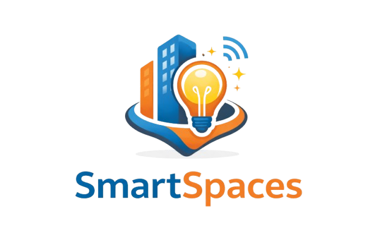
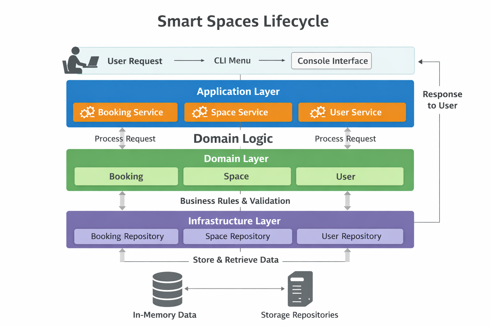

<p align="center">
  
</p>

**Intelligent Space Management System**  
Manage and optimize shared physical spaces such as classrooms, meeting rooms, and workstations, ensuring bookings are conflict-free and usage rules are automatically enforced.

---

Smart Spaces provides a clear, object-oriented simulation of space reservation and user management.  
It focuses on **modular design**, **scalable architecture**, and **rule-enforced bookings** for organizations looking to streamline resource usage.


📖 **Overview**  
The project is an **Intelligent Space Management System** designed to manage and optimize the use of shared physical
spaces within an organization, including classrooms, meeting rooms, workstations, or multipurpose rooms.

The system models reservable spaces, users with different roles, and temporary bookings, while enforcing rules based on
user type, space type, and booking conditions. It emphasizes **object-oriented design**, correct domain logic, and safe
operations without overlapping bookings or unauthorized access.

The focus is on the **domain and business rules**, independent of persistence, external APIs, or graphical interfaces.

---

🎯 **Objectives**

**General Objective**  
Develop a modular, object-oriented system that manages shared spaces and bookings coherently, preventing conflicts and
enforcing usage rules.

**Specific Objectives**

- Model users with different roles and booking constraints.
- Represent physical spaces with capacities, status, and additional features.
- Manage bookings ensuring availability and avoiding overlaps.
- Enforce rules depending on user type and space type automatically.
- Leverage inheritance and multiple inheritance for reusable and extensible design.

---

🧩 **Main Domain Entities**

The system revolves around several key entities:

- **User**: Represents people interacting with the system, with different roles and booking limits.
- **Space**: Represents physical resources available for reservation, including generic spaces and specialized meeting
  rooms.
- **Booking**: Links users to spaces for specific time intervals, tracking status and enforcing availability.

---

🏢 **Spaces Management**

The system allows:

- Registering spaces with attributes: ID, name, capacity, type, and status (available, reserved, maintenance).
- Specialized spaces (e.g., meeting rooms) can have additional features such as equipment, floor number, or number of
  power outlets.
- Checking availability for a given time interval and automatically preventing double-booking.

---

👤 **User Management**

Users can have different types and rules:

- **Basic Users**: Strict limits on active bookings and booking duration.
- **Premium Users**: Higher limits for flexibility.
- **Administrators**: Can manage all spaces, users, and bookings.

User behaviors include:

- Checking active bookings and allowed duration.
- Enforcing booking permissions based on space type.

---

📦 **Bookings and Availability Control**

- Bookings link users and spaces for a defined time period.
- Automatic validations include:
    - Space availability.
    - No overlap with existing bookings.
    - Compliance with user permissions and space rules.
- Booking statuses: **active**, **canceled**, **finished**.
- Bookings can be created, canceled, finished, or rescheduled with conflict detection.

---

🧱 **Architecture**

The system uses a layered architecture:

- **Presentation**: Console-based interactive menu (`presentation.menu`).
- **Application**: Services coordinating use cases (`BookingService`, `SpaceService`, `UserService`).
- **Domain**: Core models and rules (`User`, `Space`, `Booking`, etc.).
- **Infrastructure**: In-memory repositories and initial seed data.

This separation ensures maintainability, scalability, and clear responsibility for each layer.

---

🚀 **Installation & Execution**

Follow these steps to set up and run the Smart Spaces management system in your local environment.
The repository is on the main branch (`main`) with the current content for delivery.

### **Requirements**

- Python 3.9+
- No external dependencies (all data in-memory for simulation).

### **Installation**

1. Clone the repository:

```bash
  git clone https://github.com/Vitolofs7/SmartSpaces.git
```

2. Go to the root of the project:

```bash
  cd SmartSpaces
```

3. Run the application:

```bash
  python -m presentation.menu
```

🌳 **Workflow (Git Flow)**  
This project follows a branch-based development methodology, where each change is integrated via Pull Requests to
maintain traceability and code quality.

🔄 **Contribution Process**

1. Create a specific branch from `master` using the prefixes detailed below.
2. Make changes and commits following the naming standards.
3. Open a Pull Request (PR) describing the changes introduced.
4. Merge into the main branch after ensuring all tests pass successfully.

**Prefixes**

| Prefix    | Description                              |
|-----------|------------------------------------------|
| feature/  | New features and capabilities            |
| fix/      | Bug fixes and error corrections          |
| docs/     | Documentation updates and improvements   |
| refactor/ | Code improvements without changing logic |
| test/     | Adding or updating test cases            |


---

🌀 **Application Lifecycle & Layered Architecture**  

The Smart Spaces system follows a **layered architecture**, ensuring separation of concerns, maintainability, and clear data flow. The diagram below illustrates the lifecycle of a booking request and the interaction between layers:

1. **Presentation Layer**  
   - CLI Menu (`presentation/menu.py`) where users interact with the system.  
   - Handles input, displays output, and forwards requests to the Application Layer.

2. **Application Layer**  
   - Services (`BookingService`, `SpaceService`, `UserService`) orchestrate business logic.  
   - Validates user actions, manages booking operations, and interacts with the Domain Layer.

3. **Domain Layer**  
   - Core models and rules (`Booking`, `Space`, `User`).  
   - Encapsulates business logic, validations, and domain-specific constraints.

4. **Infrastructure Layer**  
   - Repositories (`BookingRepository`, `SpaceRepository`, `UserRepository`).  
   - Handles data storage and retrieval (in-memory for this project).  

The flow of a request is as follows: the user interacts with the **Presentation Layer**, which communicates with the **Application Layer**, triggering **Domain Layer** logic, and finally storing or retrieving data via the **Infrastructure Layer**. The response follows the reverse path back to the user.



> This layered design ensures that changes in one layer (e.g., switching from in-memory repositories to a database) have minimal impact on other layers.


📂 **Project Structure**

```text
SmartSpaces
 ┣ 📜CHANGELOG.md               # Record of project changes and versions
 ┣ 📜README.md                  # Main project documentation
 ┣ 📜__init__.py                # Root package initializer
 ┣ 📂application                # Application layer: orchestrates business logic and use cases
 ┃ ┣ 📜booking_service.py       # Services related to bookings
 ┃ ┣ 📜space_service.py         # Services related to space management
 ┃ ┣ 📜user_service.py          # Services related to user management
 ┃ ┣ 📜__init__.py              # Package initializer for the application layer
 ┣ 📂docs                       # Project documentation
 ┃ ┣ 📜BUSINESS_RULES.md        # Document describing business rules
 ┃ ┣ 📜DESCRIPTION_AND_SCOPE.md # Document detailing project description and scope
 ┃ ┣ 📜DOMAIN_MODEL.md          # Domain model diagrams and explanations
 ┃ ┣ 📜EXECUTION.md             # Instructions for running the project
 ┃ ┣ 📜INITIAL_DATA.md          # Initial seed data for testing/demo
 ┃ ┣ 📜LAYERED_ARCHITECTURE.md  # Details about the layered architecture
 ┃ ┣ 📜README.md                # Documentation specific to docs folder
 ┃ ┣ 📜REPOSITORY_CONTRACT.md   # Repository interfaces/contracts
 ┃ ┣ 📜TESTS_AND_STEPS.md       # Steps for testing and test instructions
 ┃ ┣ 📜USE_CASES.md             # Description of main use cases
 ┃ ┗ 📂img                      # Images used in README and documentation
 ┣ 📂domain                     # Domain layer: core models and business rules
 ┃ ┣ 📜booking.py               # Booking model and logic
 ┃ ┣ 📜booking_repository.py    # Booking repository interface
 ┃ ┣ 📜space.py                 # Generic space model
 ┃ ┣ 📜space_meetingroom.py     # Specialized meeting room model
 ┃ ┣ 📜space_repository.py      # Space repository interface
 ┃ ┣ 📜user.py                  # User model
 ┃ ┣ 📜user_repository.py       # User repository interface
 ┃ ┣ 📜__init__.py              # Package initializer for the domain layer
 ┣ 📂infrastructure             # Infrastructure layer: concrete implementations of repositories
 ┃ ┣ 📜booking_memory_repository.py  # In-memory implementation of Booking repository
 ┃ ┣ 📜seed_data.py             # Script to populate initial data
 ┃ ┣ 📜space_memory_repository.py    # In-memory implementation of Space repository
 ┃ ┣ 📜user_memory_repository.py     # In-memory implementation of User repository
 ┃ ┣ 📜__init__.py              # Package initializer for infrastructure layer
 ┗ 📂presentation               # Presentation layer: user interface
   ┣ 📜menu.py                  # Console menu for user interaction
   ┗ 📜__init__.py              # Package initializer for presentation layer
```

---

👤 **Author & Creator**  
Víctor Felipe Suárez – Architect and Developer of Smart Spaces

📄 **Version & Credits**  
Initial version developed as part of the Smart Spaces project. All code, documentation, and examples created by the
author.
