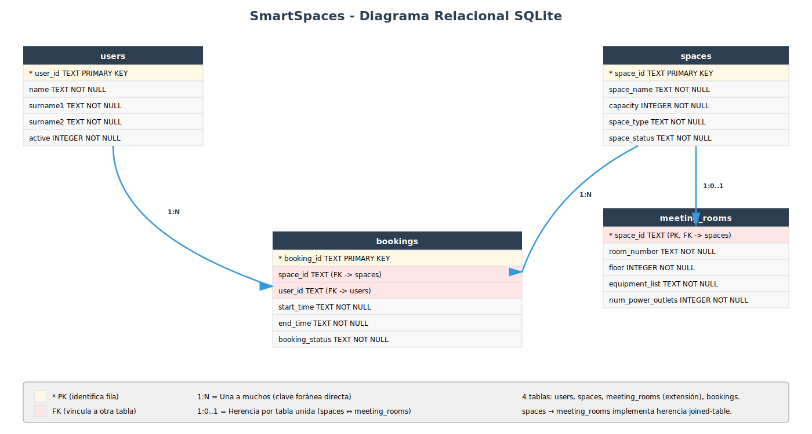

# Diseño de tablas SQLite para Sistema SmartSpaces

**Nota:** Este documento es una **guía de referencia** que parte del diseño de base de datos que **ya tienes implementado** en tu proyecto. No describe cómo deberías hacerlo desde cero, sino que documenta y explica pedagógicamente el esquema SQL que ya tenías creado (script `create_db.py`, tablas `spaces`, `meeting_rooms`, `users` y `bookings`). Su propósito es servirte como apoyo para entender las decisiones de diseño que tomaste y como base para completar la documentación de la Fase 04 (`docs/DISEÑO_BD.md`).


## Fase 1: Identificar las entidades y sus atributos

El primer paso es hacer un inventario de las clases de tu dominio que almacenan datos. Cada una de estas clases se convertirá en una **tabla** de la base de datos.

Vamos a repasar tus clases y qué atributos de cada una necesitamos guardar:

**User** (`domain/user.py`)

| Atributo | Tipo en Python | Tipo en SQL | Notas |
|---|---|---|---|
| `user_id` | str | TEXT | Identificador único del usuario |
| `name` | str | TEXT | Nombre |
| `surname1` | str | TEXT | Primer apellido |
| `surname2` | str | TEXT | Segundo apellido |
| `active` | bool | INTEGER | 1 si está activo, 0 si fue dado de baja |

**Space** (`domain/space.py`) — Clase base

| Atributo | Tipo en Python | Tipo en SQL | Notas |
|---|---|---|---|
| `space_id` | str | TEXT | Identificador único del espacio |
| `space_name` | str | TEXT | Nombre del espacio |
| `capacity` | int | INTEGER | Aforo máximo |
| `space_type` | str | TEXT | Tipo: "Basic Space", "Meeting room", "Private", etc. |
| `space_status` | str | TEXT | Estado: AVAILABLE, RESERVED, MAINTENANCE |

**SpaceMeetingRoom** (`domain/space_meetingroom.py`) — Hereda de Space

| Atributo adicional | Tipo en Python | Tipo en SQL | Notas |
|---|---|---|---|
| `room_number` | str | TEXT | Número o etiqueta de la sala |
| `floor` | int | INTEGER | Planta donde está ubicada |
| `equipment_list` | list[str] | TEXT | Lista de equipamiento (se guarda como cadena separada por comas) |
| `num_power_outlets` | int | INTEGER | Número de enchufes |

**Booking** (`domain/booking.py`)

| Atributo | Tipo en Python | Tipo en SQL | Notas |
|---|---|---|---|
| `booking_id` | str | TEXT | Identificador único de la reserva |
| `space` | Space | TEXT (`space_id`) | FK a `spaces(space_id)` |
| `user` | User | TEXT (`user_id`) | FK a `users(user_id)` |
| `start_time` | datetime | TEXT | Fecha/hora de inicio en formato ISO 8601 |
| `end_time` | datetime | TEXT | Fecha/hora de fin en formato ISO 8601 |
| `status` | str | TEXT | Estado: ACTIVE, CANCELLED, FINISHED |


## Fase 2: Conceptos básicos de bases de datos

Antes de avanzar, necesitamos entender algunos conceptos:

### Tabla, fila y columna

Una **tabla** es como un diccionario de Python, pero guardado en disco:
- Cada **fila** es un objeto individual (un usuario, un espacio, una reserva)
- Cada **columna** es un atributo de ese objeto (el nombre, la capacidad, el estado, etc.)

**Ejemplo:**
```
Tabla: users
┌─────────┬─────────┬───────────┬────────────┬────────┐
│ user_id │ name    │ surname1  │ surname2   │ active │
├─────────┼─────────┼───────────┼────────────┼────────┤
│ U1      │ Alice   │ Smith     │ Johnson    │ 1      │
│ U2      │ Bob     │ Brown     │ Taylor     │ 1      │
│ U3      │ Charlie │ Wilson    │ Anderson   │ 1      │
└─────────┴─────────┴───────────┴────────────┴────────┘
```

### Clave primaria (PRIMARY KEY)

Es la columna que **identifica de forma única cada fila**. No puede haber dos filas con el mismo valor en la clave primaria. En tu código:
- Para usuarios → `user_id` es la clave primaria
- Para espacios → `space_id` es la clave primaria
- Para reservas → `booking_id` es la clave primaria
- Para salas de reuniones → `space_id` es la clave primaria (además foránea a `spaces`)

Has elegido claves primarias **naturales** (cadenas como "U1", "S1", "B1") en lugar de `AUTOINCREMENT`, lo que te permite tener control explícito sobre los identificadores al crear entidades desde el menú.

### Clave foránea (FOREIGN KEY)

Es una columna que "apunta" a la clave primaria de **otra tabla**. Sirve para crear vínculos entre tablas y permite que la base de datos garantice que esos vínculos siempre sean válidos.

**Ejemplo:** Una reserva tiene un `space_id` que apunta a la clave primaria `space_id` de la tabla `spaces`. Si intentas guardar una reserva con un espacio que no existe, la base de datos lo rechazará automáticamente.

En SQLite, para que se apliquen las restricciones de claves foráneas lo hacemos con `PRAGMA foreign_keys = ON` al inicio de cada conexión.

### Relaciones entre tablas

Una **relación** describe cómo se vinculan las filas de una tabla A con las filas de otra tabla B. Los tipos más comunes son:

- **Uno a uno (1:1):** Una fila de la tabla A se vincula con exactamente una fila de la tabla B.
  - Ejemplo en tu proyecto: cada fila de `meeting_rooms` está vinculada con exactamente una fila de `spaces` (un "space" puede ser una "meeting room"). Es una relación **1:0..1** (un espacio genérico no tiene entrada en `meeting_rooms`, pero uno que sea meeting room sí).

- **Uno a muchos (1:N):** Una fila de la tabla A se vincula con múltiples filas de la tabla B. Muy común.
  - Ejemplo en tu proyecto: un **usuario** puede tener muchas **reservas** (1:N). El usuario U1 puede tener las reservas B1 y B5.
  - Otro ejemplo: un **espacio** puede ser reservado en muchos **bookings** a lo largo del tiempo (1:N).

- **Muchos a muchos (N:M):** Una fila de la tabla A se vincula con múltiples filas de la tabla B, y viceversa. Requiere una tabla intermedia.
  - Ejemplo general: un **alumno** puede estar matriculado en muchos **cursos**, y un **curso** puede tener muchos **alumnos**.
  - En tu proyecto **NO hay relaciones N:M directas**.


## Fase 3: Identificar las relaciones entre entidades

Cuando un objeto **"pertenece a"** o **"contiene"** otro, eso se traduce en la base de datos mediante **claves foráneas** (FK).

### Relaciones uno a muchos (1:N)

**Un usuario puede tener muchas reservas**
- Cada reserva pertenece a un único usuario
- Usamos la columna `user_id` en la tabla `bookings` como clave foránea que apunta a `users(user_id)`

**Un espacio puede aparecer en muchas reservas**
- Cada reserva apunta a un único espacio
- Usamos la columna `space_id` en la tabla `bookings` como clave foránea que apunta a `spaces(space_id)`
- A nivel de negocio, tu código valida que no haya dos reservas activas solapadas en el mismo espacio (pero eso es una regla de la aplicación, no una restricción SQL)

### Herencia en el dominio

En tu código, `SpaceMeetingRoom` hereda de `Space`. En SQL hay varias formas de mapear la herencia; has elegido la estrategia **joined-table (tabla unida)**:

- Los atributos comunes (id, nombre, capacidad, tipo, estado) van en la tabla `spaces`
- Los atributos específicos de la sala de reuniones (número, planta, equipamiento, enchufes) van en la tabla `meeting_rooms`
- Ambas tablas comparten la misma clave primaria (`space_id`): la de `meeting_rooms` es a la vez FK hacia `spaces`
- La relación es 1:0..1 (un espacio genérico no tiene fila en `meeting_rooms`; uno que sea sala de reuniones sí)

**Ventajas de esta estrategia:**
- No hay columnas NULL en `spaces` que solo se usarían para un subtipo
- Fácil añadir nuevos subtipos (p.ej. `office_rooms`, `open_spaces`) con sus propias tablas extensión
- Si se borra el espacio base, puedes configurar `ON DELETE CASCADE` para que borre también su extensión

**Contrapartida:**
- Para recuperar una sala de reuniones completa necesitas leer de dos tablas (un JOIN o dos SELECT)


## Fase 4: Diseño de las tablas

### Tabla `users` — Los usuarios del sistema

Almacena a los usuarios que pueden hacer reservas.

| Columna | Tipo | Notas |
|---|---|---|
| `user_id` | TEXT | Clave primaria (ej: "U1") |
| `name` | TEXT | Nombre (NOT NULL) |
| `surname1` | TEXT | Primer apellido (NOT NULL) |
| `surname2` | TEXT | Segundo apellido (NOT NULL) |
| `active` | INTEGER | 1 si activo, 0 si inactivo (NOT NULL) |


### Tabla `spaces` — Los espacios reservables

Almacena todos los espacios reservables del sistema, tanto los genéricos como los que son salas de reuniones.

| Columna | Tipo | Notas |
|---|---|---|
| `space_id` | TEXT | Clave primaria (ej: "S1", "SM1") |
| `space_name` | TEXT | Nombre del espacio (NOT NULL) |
| `capacity` | INTEGER | Aforo máximo (NOT NULL) |
| `space_type` | TEXT | Tipo: "Basic Space", "Meeting room", "Private" (NOT NULL) |
| `space_status` | TEXT | Estado: AVAILABLE, RESERVED, MAINTENANCE (NOT NULL) |

**¿Por qué `space_type` como cadena libre?** Porque tu dominio define el tipo de forma abierta (no todos los tipos son subclases). Por ejemplo, "Private" es solo un `space_type` sin tabla extensión propia. Solo "Meeting room" tiene sus datos extra en otra tabla.


### Tabla `meeting_rooms` — Extensión para salas de reuniones

Almacena únicamente los atributos extra que tiene un espacio cuando es **sala de reuniones**. Para un espacio genérico esta tabla no tendrá fila correspondiente.

| Columna | Tipo | Notas |
|---|---|---|
| `space_id` | TEXT | Clave primaria Y clave foránea → `spaces(space_id)` ON DELETE CASCADE |
| `room_number` | TEXT | Número o etiqueta de la sala (NOT NULL) |
| `floor` | INTEGER | Planta (NOT NULL) |
| `equipment_list` | TEXT | Lista de equipamiento separada por comas (ej: "Projector,Whiteboard") (NOT NULL) |
| `num_power_outlets` | INTEGER | Número de enchufes (NOT NULL) |

**¿Por qué `equipment_list` se guarda como texto separado por comas?** Es una simplificación habitual cuando la lista es pequeña, no va a crecer mucho y no se consulta por cada elemento. La alternativa sería una tercera tabla `room_equipment` con una fila por elemento, pero en tu caso es innecesario.

**¿Por qué `ON DELETE CASCADE`?** Porque si se borra el espacio base, su extensión de sala de reuniones no debe quedar huérfana. El CASCADE lo hace automático.


### Tabla `bookings` — Las reservas

Almacena las reservas hechas por los usuarios sobre los espacios.

| Columna | Tipo | Notas |
|---|---|---|
| `booking_id` | TEXT | Clave primaria (ej: "B1") |
| `space_id` | TEXT | Clave foránea → `spaces(space_id)` (NOT NULL) |
| `user_id` | TEXT | Clave foránea → `users(user_id)` (NOT NULL) |
| `start_time` | TEXT | Fecha/hora de inicio en formato ISO 8601 (NOT NULL) |
| `end_time` | TEXT | Fecha/hora de fin en formato ISO 8601 (NOT NULL) |
| `booking_status` | TEXT | Estado: ACTIVE, CANCELLED, FINISHED (NOT NULL) |

**¿Por qué `start_time` y `end_time` son TEXT?** SQLite almacena fechas como cadenas ISO 8601 (ej: "2026-04-20T18:00:00"). Es estándar, ordenable alfabéticamente y compatible con `datetime.fromisoformat()` en Python.

### Diagrama relacional resultante

Con el diseño de tablas descrito arriba, el esquema de la base de datos queda así:



El diagrama muestra las 4 tablas del sistema y sus relaciones:
- **spaces ↔ meeting_rooms** (1:0..1): cada sala de reuniones extiende un espacio base
- **spaces → bookings** (1:N): un espacio puede aparecer en muchas reservas
- **users → bookings** (1:N): un usuario puede hacer muchas reservas


## Fase 5: SQL de creación

Aquí tienes el SQL completo para crear todas las tablas. **El orden importa:** las tablas que son referenciadas por otras (con claves foráneas) deben crearse primero.

```sql
PRAGMA foreign_keys = ON;

-- 1. Tabla de usuarios (no depende de otras)
CREATE TABLE IF NOT EXISTS users (
    user_id TEXT PRIMARY KEY,
    name TEXT NOT NULL,
    surname1 TEXT NOT NULL,
    surname2 TEXT NOT NULL,
    active INTEGER NOT NULL
);

-- 2. Tabla de espacios (no depende de otras)
CREATE TABLE IF NOT EXISTS spaces (
    space_id TEXT PRIMARY KEY,
    space_name TEXT NOT NULL,
    capacity INTEGER NOT NULL,
    space_type TEXT NOT NULL,
    space_status TEXT NOT NULL
);

-- 3. Extensión para salas de reuniones (depende de spaces)
CREATE TABLE IF NOT EXISTS meeting_rooms (
    space_id TEXT PRIMARY KEY,
    room_number TEXT NOT NULL,
    floor INTEGER NOT NULL,
    equipment_list TEXT NOT NULL,
    num_power_outlets INTEGER NOT NULL,
    FOREIGN KEY (space_id) REFERENCES spaces(space_id) ON DELETE CASCADE
);

-- 4. Tabla de reservas (depende de spaces y users)
CREATE TABLE IF NOT EXISTS bookings (
    booking_id TEXT PRIMARY KEY,
    space_id TEXT NOT NULL,
    user_id TEXT NOT NULL,
    start_time TEXT NOT NULL,
    end_time TEXT NOT NULL,
    booking_status TEXT NOT NULL,
    FOREIGN KEY (space_id) REFERENCES spaces(space_id),
    FOREIGN KEY (user_id) REFERENCES users(user_id)
);
```

**Explicación del orden:**
1. **users** y **spaces** se crean primero porque no tienen claves foráneas
2. **meeting_rooms** depende de `spaces`
3. **bookings** depende de `spaces` y `users`


## Fase 6: Script de ejemplo para crear la base de datos

Este es el esquema del script que ya tienes en `create_db.py`. Como referencia, crea la base de datos con todas las tablas e inserta datos iniciales:

```python
"""Script para crear la base de datos de SmartSpaces con datos iniciales."""

import sqlite3
from pathlib import Path

# Eliminar la base de datos si ya existe (para recrearla limpia)
ruta_bd = Path("smartspaces.db")
if ruta_bd.exists():
    ruta_bd.unlink()

conn = sqlite3.connect(ruta_bd)
cursor = conn.cursor()
cursor.execute("PRAGMA foreign_keys = ON")

# Crear tablas (en el orden correcto: sin dependencias primero)
cursor.executescript("""
PRAGMA foreign_keys = ON;

CREATE TABLE IF NOT EXISTS users (
    user_id TEXT PRIMARY KEY,
    name TEXT NOT NULL,
    surname1 TEXT NOT NULL,
    surname2 TEXT NOT NULL,
    active INTEGER NOT NULL
);

CREATE TABLE IF NOT EXISTS spaces (
    space_id TEXT PRIMARY KEY,
    space_name TEXT NOT NULL,
    capacity INTEGER NOT NULL,
    space_type TEXT NOT NULL,
    space_status TEXT NOT NULL
);

CREATE TABLE IF NOT EXISTS meeting_rooms (
    space_id TEXT PRIMARY KEY,
    room_number TEXT NOT NULL,
    floor INTEGER NOT NULL,
    equipment_list TEXT NOT NULL,
    num_power_outlets INTEGER NOT NULL,
    FOREIGN KEY (space_id) REFERENCES spaces(space_id) ON DELETE CASCADE
);

CREATE TABLE IF NOT EXISTS bookings (
    booking_id TEXT PRIMARY KEY,
    space_id TEXT NOT NULL,
    user_id TEXT NOT NULL,
    start_time TEXT NOT NULL,
    end_time TEXT NOT NULL,
    booking_status TEXT NOT NULL,
    FOREIGN KEY (space_id) REFERENCES spaces(space_id),
    FOREIGN KEY (user_id) REFERENCES users(user_id)
);
""")

# Datos iniciales de ejemplo

# 1. Usuarios
cursor.executemany(
    "INSERT INTO users (user_id, name, surname1, surname2, active) VALUES (?, ?, ?, ?, ?)",
    [
        ("U1", "Alice",   "Smith",   "Johnson",  1),
        ("U2", "Bob",     "Brown",   "Taylor",   1),
        ("U3", "Charlie", "Wilson",  "Anderson", 1),
        ("U4", "Diana",   "Martinez","Lopez",    1),
        ("U5", "Eve",     "Davis",   "Clark",    1),
    ],
)

# 2. Espacios básicos y de meeting room
cursor.executemany(
    "INSERT INTO spaces (space_id, space_name, capacity, space_type, space_status) VALUES (?, ?, ?, ?, ?)",
    [
        ("S1",  "Conference Room",     5,  "Basic Space",   "AVAILABLE"),
        ("S2",  "Open Space",          10, "Basic Space",   "AVAILABLE"),
        ("SM1", "Main Meeting Room",   8,  "Meeting room",  "AVAILABLE"),
        ("SM2", "Small Meeting Room",  4,  "Meeting room",  "AVAILABLE"),
        ("S3",  "Private Office",      2,  "Private",       "AVAILABLE"),
    ],
)

# 3. Extensiones de meeting room
cursor.executemany(
    "INSERT INTO meeting_rooms (space_id, room_number, floor, equipment_list, num_power_outlets) VALUES (?, ?, ?, ?, ?)",
    [
        ("SM1", "101", 1, "Projector,Whiteboard", 4),
        ("SM2", "102", 1, "TV",                   2),
    ],
)

# 4. Reservas iniciales
cursor.executemany(
    "INSERT INTO bookings (booking_id, space_id, user_id, start_time, end_time, booking_status) VALUES (?, ?, ?, ?, ?, ?)",
    [
        ("B1", "S1",  "U1", "2026-04-20T10:00:00", "2026-04-20T12:00:00", "ACTIVE"),
        ("B2", "SM1", "U2", "2026-04-21T10:00:00", "2026-04-21T12:00:00", "ACTIVE"),
        ("B3", "S2",  "U3", "2026-04-20T14:00:00", "2026-04-20T16:00:00", "ACTIVE"),
    ],
)

conn.commit()
conn.close()

print("Base de datos creada en: smartspaces.db")
```

**Características importantes:**
- Elimina la BD existente para recrearla limpia (idempotente)
- Crea las tablas en el orden correcto respetando claves foráneas
- Activa integridad referencial con `PRAGMA foreign_keys = ON`
- Inserta datos de ejemplo (5 usuarios, 5 espacios, 2 meeting rooms, 3 reservas)


## Fase 7: Ejemplo de implementación del repositorio SQLite

Tus interfaces `UserRepository`, `SpaceRepository` y `BookingRepository` (en `domain/`) definen los métodos que cualquier implementación de repositorio debe cumplir: `save`, `get`, `list`, `delete`, `update`. Tienes ya dos implementaciones: una **en memoria** (`infrastructure/*_memory_repository.py`) y otra **SQLite** (`infrastructure/*_sqlite_repository.py`). Aquí vemos los patrones clave.

**Excepciones de dominio:** tus excepciones están definidas en `domain/exceptions.py`:

```python
class RepositoryException(Exception):
    """Excepción base para todos los errores de persistencia."""
    pass

class UserAlreadyExistsException(RepositoryException):
    pass

class UserNotFoundError(RepositoryException):
    pass

class SpaceAlreadyExistsException(RepositoryException):
    pass

class SpaceNotFoundError(RepositoryException):
    pass

class BookingAlreadyExistsException(RepositoryException):
    pass

class BookingNotFoundError(RepositoryException):
    pass

class PersistenceException(RepositoryException):
    """Se lanza ante cualquier otro error inesperado del motor de base de datos."""
    pass
```

**Ejemplo para `UserSQLiteRepository` — Método `save()`:**

```python
import sqlite3
from domain.user import User
from domain.user_repository import UserRepository
from domain.exceptions import UserAlreadyExistsException, PersistenceException


class UserSQLiteRepository(UserRepository):
    def __init__(self, db_path="smartspaces.db"):
        self._db_path = db_path

    def _connect(self):
        """Crea una conexión con integridad referencial activada."""
        conn = sqlite3.connect(self._db_path)
        conn.execute("PRAGMA foreign_keys = ON")
        return conn

    def save(self, user):
        """Guarda un nuevo usuario en la base de datos."""
        conn = self._connect()
        try:
            with conn:
                cursor = conn.cursor()
                cursor.execute(
                    """INSERT INTO users (user_id, name, surname1, surname2, active)
                       VALUES (?, ?, ?, ?, ?)""",
                    (
                        user.user_id,
                        user.name,
                        user.surname1,
                        user.surname2,
                        1 if user.is_active() else 0,
                    ),
                )
        except sqlite3.IntegrityError as e:
            # IntegrityError → violación de PRIMARY KEY (user_id duplicado)
            raise UserAlreadyExistsException(
                f"User with id '{user.user_id}' already exists"
            ) from e
        except sqlite3.OperationalError as e:
            # OperationalError → problema técnico (conexión, sintaxis, permisos)
            raise PersistenceException(f"Error saving user: {e}") from e
        finally:
            conn.close()
```

**Explicación:**
1. `_connect()` crea una conexión y activa `PRAGMA foreign_keys = ON`, centralizando esta lógica en un único sitio.
2. La consulta `INSERT` usa parámetros `?` para prevenir inyección SQL.
3. Aprovechamos la restricción `PRIMARY KEY` de `user_id` para detectar duplicados: SQLite lanza `IntegrityError`, que transformamos en `UserAlreadyExistsException`.
4. Convertimos el booleano Python `is_active()` al entero `1`/`0` para almacenarlo.

**Ejemplo para `SpaceSQLiteRepository` — Método `get()` con herencia:**

Recuperar un espacio es interesante porque, si es una sala de reuniones, hay que leer de dos tablas y reconstruir la subclase correcta:

```python
import sqlite3
from domain.space import Space
from domain.space_meetingroom import SpaceMeetingRoom
from domain.space_repository import SpaceRepository
from domain.exceptions import PersistenceException


class SpaceSQLiteRepository(SpaceRepository):
    def __init__(self, db_path="smartspaces.db"):
        self._db_path = db_path

    def _connect(self):
        conn = sqlite3.connect(self._db_path)
        conn.execute("PRAGMA foreign_keys = ON")
        return conn

    def get(self, space_id):
        """Recupera un espacio por su id. Devuelve None si no existe."""
        conn = self._connect()
        try:
            cursor = conn.cursor()
            cursor.execute(
                """SELECT space_id, space_name, capacity, space_type, space_status
                   FROM spaces WHERE space_id = ?""",
                (space_id,),
            )
            row = cursor.fetchone()
            if row is None:
                return None
            s_id, name, capacity, s_type, status = row

            # Si es una sala de reuniones, cargar también sus atributos extra
            if s_type == "Meeting room":
                cursor.execute(
                    """SELECT room_number, floor, equipment_list, num_power_outlets
                       FROM meeting_rooms WHERE space_id = ?""",
                    (s_id,),
                )
                mr_row = cursor.fetchone()
                if mr_row is None:
                    raise PersistenceException(
                        f"Meeting room '{s_id}' missing its extension row"
                    )
                room_number, floor, equipment_csv, num_outlets = mr_row
                equipment = equipment_csv.split(",") if equipment_csv else []
                obj = SpaceMeetingRoom(s_id, name, capacity, room_number, floor, equipment, num_outlets)
            else:
                obj = Space(s_id, name, capacity, space_type=s_type)

            # Restaurar el estado (el constructor lo inicializa a AVAILABLE)
            obj._space_status = status
            return obj
        except sqlite3.OperationalError as e:
            raise PersistenceException(f"Error reading space: {e}") from e
        finally:
            conn.close()
```

**Puntos clave de ambos métodos:**
- Siempre activa `PRAGMA foreign_keys = ON` a través de `_connect()`.
- Usa parámetros `?` en lugar de concatenar strings (previene inyección SQL).
- Transforma `sqlite3.IntegrityError` y `sqlite3.OperationalError` en excepciones de dominio.
- `get()` devuelve `None` cuando el espacio no existe, respetando el contrato actual.
- Para reconstruir una sala de reuniones (subtipo), necesitas **dos consultas**: una a `spaces` y otra a `meeting_rooms`. El campo `space_type` actúa como discriminador para saber si hay que hacer la segunda consulta.
- `equipment_list` se guarda como cadena separada por comas y se divide al recuperar.
- Después de construir el objeto, se restaura `_space_status` asignando directamente al atributo privado (porque el constructor lo inicializa a AVAILABLE).


## Resumen: de memoria a SQLite

### Mapeado de conceptos

| Código Python (repositorio en memoria) | Base de datos SQLite (repositorio SQLite) | Propósito |
|---|---|---|
| `UserMemoryRepository` con dict interno | Tabla `users` | Guardar todos los usuarios persistentemente |
| `SpaceMemoryRepository` con dict interno | Tablas `spaces` + `meeting_rooms` | Guardar todos los espacios con su jerarquía |
| `BookingMemoryRepository` con dict interno | Tabla `bookings` | Guardar todas las reservas persistentemente |

### Beneficios de migrar a SQLite

- **Persistencia:** Los datos no desaparecen al cerrar el programa
- **Integridad referencial:** Las claves foráneas garantizan que no habrá datos rotos (ej: una reserva con un usuario que no existe)
- **Escalabilidad:** Manejo eficiente de grandes volúmenes de datos
- **Estándar:** SQL es un estándar conocido y usado en la industria
- **Simple:** SQLite no necesita un servidor externo, es un fichero `smartspaces.db`

### Arquitectura en capas (sin cambios en lógica)

```
┌─────────────────────────────────────┐
│  Presentation (menú)                │
│  - No toca datos                    │
└──────────────┬──────────────────────┘
               │ usa
┌──────────────▼──────────────────────┐
│  Application (servicios)            │
│  - UserService, SpaceService,       │
│    BookingService                   │
│  - Usa los repositorios             │
└──────────────┬──────────────────────┘
               │ usa
┌──────────────▼──────────────────────┐
│  Domain (entidades + contratos)     │
│  - User, Space, SpaceMeetingRoom,   │
│    Booking                          │
│  - UserRepository, SpaceRepository, │
│    BookingRepository (contratos)    │
└──────────────┬──────────────────────┘
               │ implementado por
┌──────────────▼──────────────────────┐
│  Infrastructure (implementación)    │
│  - UserSQLiteRepository,            │
│    SpaceSQLiteRepository,           │
│    BookingSQLiteRepository          │
│  - Lee/escribe en tablas            │
└─────────────────────────────────────┘
```

**Lo importante:** Domain y Application no cambian. Solo Infrastructure.


## Estado de la Checklist Fase 04

Marcamos con [x] los apartados que **ya tienes implementados** en tu proyecto y con [ ] los que quedan pendientes. Para los apartados pendientes puedes consultar cómo se hicieron en el proyecto modelo de la expendedora (`modelo/cepy_pd4/proyecto/04-sqlite/expendedora/`).

### Diseño e implementación del esquema de base de datos

- [x] Copiar en `04-sqlite` el estado base de `03-testing` (o crear rama específica para la fase 04) — *Hecho*
- [x] Diseñar las tablas SQL mapeando cada entidad de dominio a tablas con sus columnas, tipos y restricciones (`PRIMARY KEY`, `NOT NULL`, `FOREIGN KEY`) — **Fases 1-4 de este documento**
- [x] Usar nombres de columnas en snake_case — *Hecho*

### Script de inicialización de base de datos

- [x] Crear script que cree el esquema de la BD e inserte datos iniciales de prueba — *Hecho: tienes `create_db.py` en la raíz del proyecto*
  - [x] Debe poder ejecutarse varias veces sin error — *Hecho: tu script elimina el fichero .db antes de crearlo*
  - [x] Crea todas las tablas respetando dependencias de claves foráneas — *Hecho*
  - [x] Inserta datos iniciales para probar la aplicación — *Hecho: 5 usuarios, 5 espacios, 2 meeting rooms, 3 reservas*

### Excepciones de dominio para persistencia

- [x] (*opcional*) Crear fichero de excepciones con las excepciones que el repositorio SQLite lanza al usuario — *Hecho: `domain/exceptions.py`*
  - [x] Clase base para todas las excepciones de persistencia — *Hecho: `RepositoryException`*
  - [x] Excepciones por cada tipo de error que puede ocurrir (duplicado, no encontrado, etc.) — *Hecho: `UserAlreadyExistsException`, `UserNotFoundError`, `SpaceAlreadyExistsException`, `SpaceNotFoundError`, `BookingAlreadyExistsException`, `BookingNotFoundError`, `PersistenceException`*

### Implementación del repositorio SQLite

- [x] Crear clase(s) de repositorio que implementen persistencia en SQLite — *Hecho: `UserSQLiteRepository`, `SpaceSQLiteRepository`, `BookingSQLiteRepository`*
- [x] Usar consultas SQL parametrizadas (parámetros `?`) para prevenir inyección SQL — *Hecho*
- [x] Capturar excepciones SQLite (`sqlite3.IntegrityError`, `sqlite3.OperationalError`, etc.) y transformarlas en excepciones de dominio — *Hecho*
- [x] Activar `PRAGMA foreign_keys = ON` al conectar para garantizar integridad referencial — *Hecho en `_connect()`*
- [x] **El flujo principal de la aplicación (menú) debe usar SOLO el repositorio SQLite para persistencia** — *Hecho: `presentation/menu.py` instancia los repositorios SQLite*

### Repositorio en memoria (referencia, no en uso)

- [x] (**opcional**) Mantener el código del repositorio en memoria como referencia de implementación y contrato — *Hecho: conservas los `*_memory_repository.py`*
- [ ] (**opcional**) Modificar el repositorio en memoria para lanzar las **mismas excepciones de dominio** que el repositorio SQLite — *Verificar que tus `*_memory_repository.py` lanzan `UserAlreadyExistsException`, etc.*

### Integración con SQLite en la capa de presentación

- [x] Modificar la capa de presentación para cargar datos desde la BD — *Hecho: `menu.py` usa los repositorios SQLite*
- [x] Capturar excepciones de dominio, no excepciones de `sqlite3` — *Hecho: captura `RepositoryException`*
- [x] (*opcional*) Mostrar mensajes amigables al usuario cuando ocurran errores de persistencia — *Hecho*
- [x] No hacer imports de `sqlite3` directamente en la presentación — *Hecho*

### Actualización de los tests

- [x] *(opcional)* Actualizar tests existentes para esperar excepciones de dominio en lugar de excepciones genéricas — *Hecho*
- [ ] Verificar que `python -m unittest` pasa con todos los tests en verde — *Responsabilidad tuya: ejecuta para verificar*
- [x] *(opcional)* Crear tests específicos para el repositorio SQLite — *Hecho: `test_sqlite_repository.py`*

### Documentación

- [x] Actualizar `CHANGELOG.md` (versión `0.4.0`) con los cambios principales — *Hecho: entradas 0.4.0 y 0.4.1*
- [x] Actualizar `README.md` con instrucciones de cómo ejecutar el script de inicialización — *Hecho*
- [ ] Documentar el diseño de la BD en `docs/DISEÑO_BD.md` (opcional) — *Este documento es base para completarlo*
- [ ] (*opcional*) Documentar el contrato de excepciones en `docs/CONTRATO_EXCEPCIONES.md` — *Podría complementar tu `REPOSITORY_CONTRACT.md`*

### Verificación final

- [x] La aplicación funciona igual desde el punto de vista del usuario — *Hecho*
- [x] Los datos persisten entre ejecuciones — *Hecho*
- [ ] Los tests pasan todos sin cambios de lógica de dominio — *Responsabilidad tuya: ejecuta para verificar*


## Próximos pasos

Tu Fase 04 está **muy avanzada**. Los puntos pendientes son principalmente de documentación y verificación:

1. Lee este documento con atención y úsalo como base para escribir `docs/DISEÑO_BD.md`.
2. Considera añadir `docs/CONTRATO_EXCEPCIONES.md` que documente formalmente tu `domain/exceptions.py`.
3. Ejecuta `python -m unittest` para verificar que todos los tests pasan en verde.
4. Revisa que tus repositorios en memoria lanzan las mismas excepciones de dominio que los SQLite (si quieres que sean intercambiables sin cambios de comportamiento).
